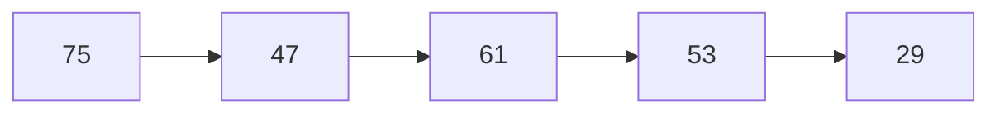
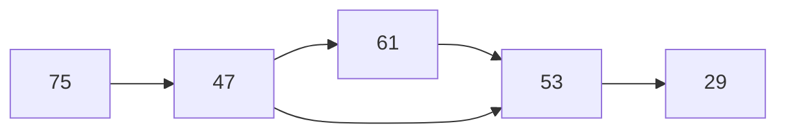

# Advent of Code 2024 — Day 5

## Approach

We will start by creating a directed graph from the pages to produce in each
update.

For example, given the pages `75, 47, 61, 53, 29` we would create the following
graph:

Each node corresponds to a page, and an edge points from each page to the
successive page in the sequence.

Once this graph is constructed, we can modify it to model the page ordering
rules.

Given a page ordering rule, e.g. `47|53`, we add a new edge to the graph
pointing from the first page to the second page as long as both nodes exist.

With this graph constructed, we can perform cycle detection on it. We know
that the pages are in a correct order if the graph has zero cycles.

A cycle in this graph indicates that an ordering rule has been broken.
