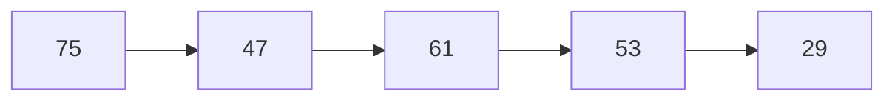

# Advent of Code 2024 — Day 5

## Approach

Given a list of pages to produce, we create a directed graph with a node for
each page and an edge pointing from each page to the next one in the sequence.

For example, given the pages `75, 47, 61, 53, 29` we would create the following graph:

